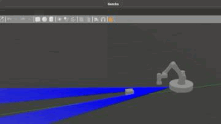

# Pick-and-Place-Using-A-Mobile-Base-Manipulator

## Overview
This repository contains a ROS2-based simulation package for a mobile base manipulator designed for autonomous pick-and-place tasks. The manipulator arm selected for this project is the UR3e manipulator, integrated with a mobile base to move the arm around and pick objects in an environment. This system uses forward and inverse kinematics, with a vacuum gripper and LiDAR sensor for object detection and manipulation.


## Instructions to Build

1. Unzip the 'mobile_manipulator.zip' to get the 'mobile_manipulator' folder.
2. Place the `mobile_manipulator` folder in your ROS2 workspace.
3. Build the package:
   ```bash
   colcon build --symlink-install

## Instructions to Run

1. **Source the workspace**  
   After building the package, source the workspace:
   ```bash
   source install/local_setup.bash
2. **Launch the simulation**
   Launch the Gazebo world with the mobile base manipulator and pickup objects:
   ```bash
   ros2 launch mobile_manipulator gazebo.launch.py
3. **Run the pick and place node**
   To run the pick and place functionality, execute the following:
   ```bash
   ros2 run mobile_manipulator pick_place_node.py

## Robot Design & Kinematics
- The robot consists of a UR3e manipulator arm (6 DOFs) and a mobile base (4 DOFs), for a total of 10 DOFs.
- Forward kinematics were calculated using DH parameters, and inverse kinematics were derived using the Jacobian inverse method for accurate joint control.
- The workspace is organized with ROS2 packages for the manipulator, simulation control, and environment definitions.

The design of the mobile manipulator, including the mobile base and manipulator arm, is shown below:

<div align="center">
  
</div>

This diagram illustrates the frame assignment used for kinematics in the manipulator:

<div align="center">
  
</div>

## Application & Control
The system autonomously detects, picks up, and places objects. An open-loop control method, with no PID controllers, is used for simplicity in the task execution. Visualization is done via Gazebo and RViz.

The following image shows the inverse kinematics validation and trajectory planning for the mobile manipulator:

<div align="center">
  
</div>

This image demonstrates the forward kinematics and the position of the robot in its workspace:

<div align="center">
  
</div>

The robot's movement and visualization in RViz are illustrated below:

<div align="center">
  
</div>


<div align="center">
  
</div>

## Challenges & Lessons
- Integration of a vacuum gripper posed challenges in object handling, and the camera unit wasn’t fully implemented.
- The project enhanced understanding of kinematics, ROS2 control, and robotic simulation environments.

## Future Work
- Extend the system's capabilities by adding more sensors like cameras.
- Improve the robot's steering and object manipulation abilities for more complex tasks.

## References
1. ROS 2, GitHub: https://github.com/ros2
2. Universal Robots DH Parameters: https://www.universal-robots.com/articles/ur/application-installation/dh-parameters-for-calculations-of-kinematics-and-dynamics/
3. Collaborative Robot Applications: https://www.universal-robots.com/applications/
4. NOAA's National Ocean Service - What is LiDAR: https://oceanservice.noaa.gov/facts/lidar.html


